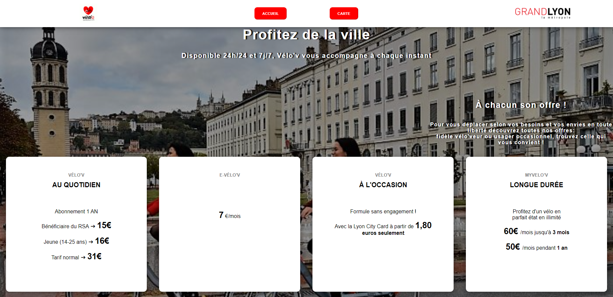
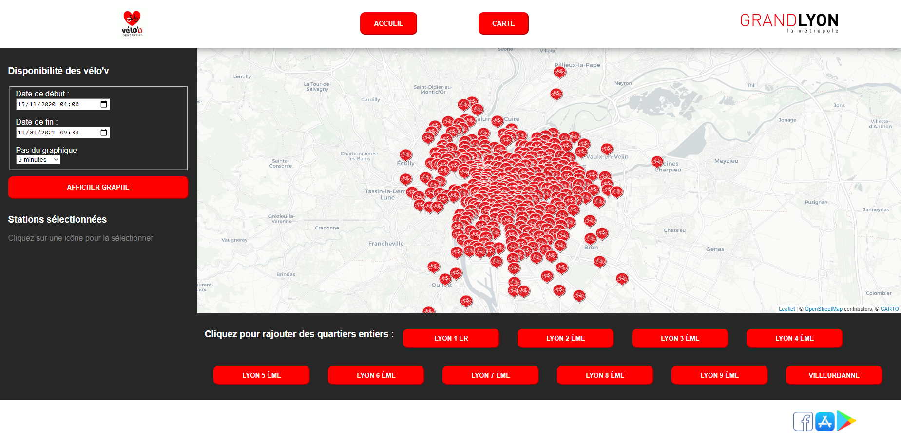

**Projet application Web: Disponibilité des Velo'V**
===========
Description générale
==========
Vélo’v est un réseau de vélos en libre-service sur Lyon.
Le but de ce projet est de créer une application web qui permet aux utilisateurs de ce service de visualiser de manière simple et intuitive la disponibilité des vélos dans les stations sélectionnées sur une carte glissante. Le résultat sera affiché sur des graphes.
L'utilisateur aura accès,en plus des stations/arrondissements sélectionnées, à un jeu de paramètres à choisir:
1. la date de début 
2. la date de fin
3. le pas de temps  

Instructions de lancement du site 
==========
Pour lancer l'application WEB, il faut:
1. accéder au code serveur et le lancer 
2. accéder au navigateur choisi et écrire l'adresse suivante :"**localhost:**'numéro du port'"
3. Dans la page "carte", l'utilisateur sélectionne les stations sur la carte glissante ainsi que les paramètres et appuie sur "AFFICHER GRAPHE"

Membres de l'équipe et distribution des rôles
===========

Audrey :         CSS

Agathe :         HTML

Mohamed Khalil : Python / traçage des courbes

Nicolas :        Placement icône / arrondissement

Arthur :         JavaScript / Cache / Interaction des différents pôles

Organisation des fichiers
==========
Notre dossier principal contient:
- un dossier "_client_" relatif à la partie HTML et CSS qui contient les pages web créées. 
- un dossier "_Données_" contenant la base de données.
- un code "_serveur_" qui s'occupe du fonctionnement correct du serveur. 
- un code "_courbe_" qui gère la base de données et trace les graphes à partir des paramètres choisis.

Résultat final en captures d'écran
==========
La page d'accueil:

La page de la carte:

